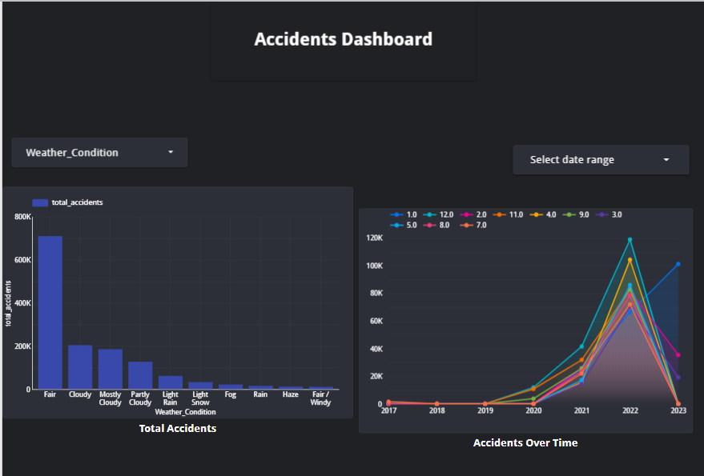
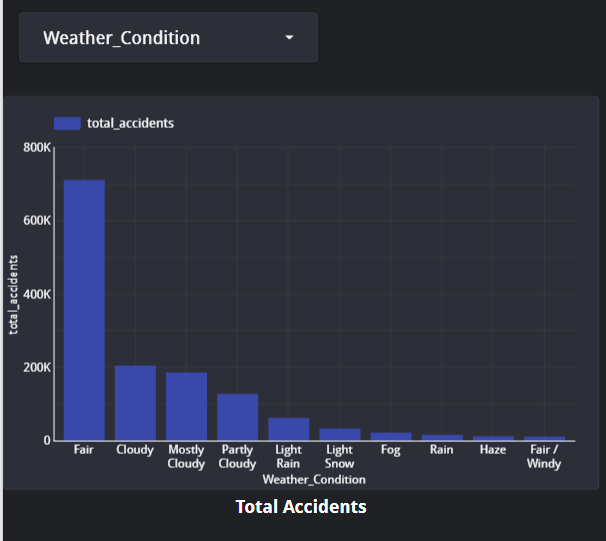
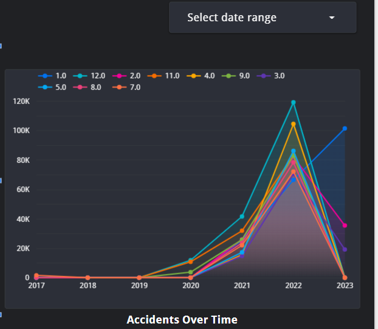

# Data Engineering Zoomcamp 2025 Project Report

## Project Overview
This project involves setting up a data pipeline and creating a dashboard for visualizing U.S. traffic accidents. We processed the data using various cloud tools and visualized key trends.

## Tech Stack
- Google Cloud Storage (Data Lake)
- BigQuery (Data Warehouse)
- Looker Studio (Dashboard)

## Dashboard Preview

### Screenshot 1: Full Dashboard

### Screenshot 2: Accidents by Weather Condition

### Screenshot 2: Accidents Over Time

## Conclusion
This project highlights the power of data pipelines and dashboards for making real-time, data-driven decisions.
